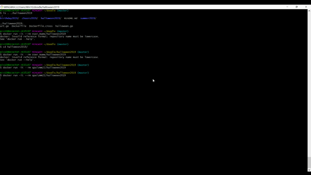
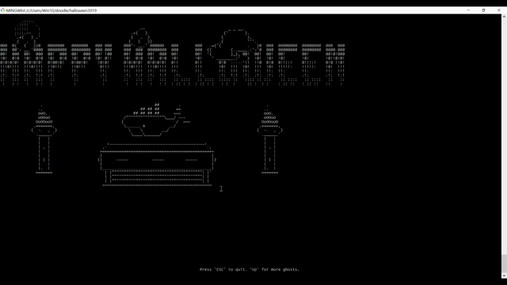

# docker 조금 더 이해하기  #

Programmer Base Day 2 의 과제로 docker에 대하여 더 알고 싶어 저는 3번 과제를 선택했습니다.

`
3. 도커 허브에서 컨테이너 아무거나 골라서 실행해보고 테스트해보고 결과를 readme.md 에 정리해서 발표하기.
`

---

다음은 docker에서 제공하는 [Quick Start Tutorial](https://hub.docker.com/?overlay=onboarding) 을 따라한 것입니다.

1. 깃허브에서 다음의 주소를 클론하여 가져옵니다.

```shell
$ git clone https://github.com/docker/doodle.git

```
    깃안에 있는 파일들은 다음과 같은 구조로 되어있습니다.


---
2. 가져온 파일들 중 하나의 폴더에 들어가 다음의 docker 명령어를 실행합니다. 
    
    `docker build -t User_Name/halloween2019` 
    
    여기서 User_Name은 docker user name 입니다.

    tutorial 설명엔 이것이 'Dockerfile' 이라는 것을 사용해 image를 만드는 것이라고 합니다. 저는 이것이 makefile과 비슷한 것이라고 추측해봅니다.

```shell
$ cd doodle/halloween2019
$ docker build -t User_Name/halloween2019 .
```
---
3. 이제 container를 생성하는 명령어를 입력합니다. 

```shell
$ docker run -it --rm User_Name/halloween2019
```
---
다음은 halloween conatainer를 실행시킨 결과입니다.


---

화살표 up 버튼을 누르면 ghost가 한마리씩 생겨납니다.

---





